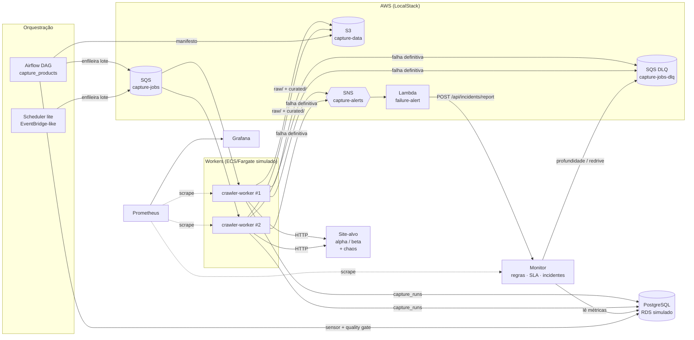

# Arquitetura

## Visão geral



## Mapeamento local → AWS real

| Local | AWS em produção | Observação |
|---|---|---|
| `crawler-worker` (2 réplicas Docker) | **ECS Service** em **Fargate** | `make scale N=4` equivale a alterar o `desiredCount`; o SIGTERM é tratado (graceful shutdown) |
| LocalStack SQS + DLQ | **SQS** com `RedrivePolicy` (`maxReceiveCount=3`) | Retry via *visibility timeout* com backoff |
| LocalStack S3 | **S3** (data lake `raw/` e `curated/` particionado por `dt=`) | O HTML bruto guardado permite diagnosticar quebras de layout |
| LocalStack SNS + Lambda | **SNS → Lambda** | A Lambda usa só stdlib (pacote mínimo) |
| PostgreSQL (container) | **RDS PostgreSQL** | `capture_runs`, `incidents` e `incident_events` |
| Scheduler lite | **EventBridge Scheduler** | Alternativa leve ao Airflow |
| Airflow standalone | **MWAA** (Managed Airflow) | DAG com sensor, quality gate e manifesto |
| Monitor (FastAPI) | ECS Service atrás de um ALB, ou Lambda + API Gateway | Poderia ser substituído por CloudWatch Alarms + PagerDuty/Opsgenie |
| Prometheus + Grafana | Amazon Managed Prometheus/Grafana, ou CloudWatch | Logs em JSON prontos para o CloudWatch Logs Insights |
| `ec2` | Não utilizado | Fargate dispensa gerenciar instâncias; o EC2 entraria em capacity providers para workloads pesadas |

## Fluxo de um job

1. A orquestração publica um lote de jobs (`fonte × categoria × página`) no SQS.
2. O worker recebe a mensagem, faz o request (timeout de 8s, retry imediato em 5xx/conexão).
3. O HTML bruto vai para `s3://capture-data/raw/...` **antes** do parse.
4. O parser da fonte (Template Method, ver `ProductParser`) extrai os produtos.
5. A validação descarta itens inválidos e rejeita a página se passarem de 20%.
6. Os produtos válidos vão para `curated/` e a execução é registrada em `capture_runs`.

## Classificação de falhas

```
CaptureError
├── TransientError (retry via SQS com backoff; DLQ na 3ª tentativa)
│   ├── FetchTimeoutError        timeout
│   ├── ConnectionFailedError    connection_error   (+ retry imediato)
│   ├── UpstreamServerError      http_5xx           (+ retry imediato)
│   ├── RateLimitedError         rate_limited       (respeita Retry-After)
│   └── UnexpectedError          unexpected         (bug: loga stacktrace)
└── PermanentError (DLQ imediata + alerta SNS)
    ├── ClientHttpError          http_4xx
    ├── LayoutChangedError       layout_changed
    ├── DataValidationError      data_validation
    └── UnknownSourceError       unknown_source
```

## Decisões de design

- **Idempotência**: cada job tem um `job_id`; reprocessar só gera novos arquivos com a mesma chave lógica,
  e `capture_runs` guarda todas as tentativas (útil para auditoria).
- **Monitoramento a partir de dados de negócio** (taxa de sucesso, freshness), não só de infraestrutura.
- **Deduplicação de alertas** por `fingerprint` (regra + fonte): um problema gera um incidente, não centenas.
- **A severidade só sobe automaticamente**: rebaixar é decisão humana, para evitar que um incidente "pisque".
- **Resolução automática** apenas para regras métricas; incidentes vindos da DLQ exigem resolução manual
  documentada, porque envolvem redrive.
