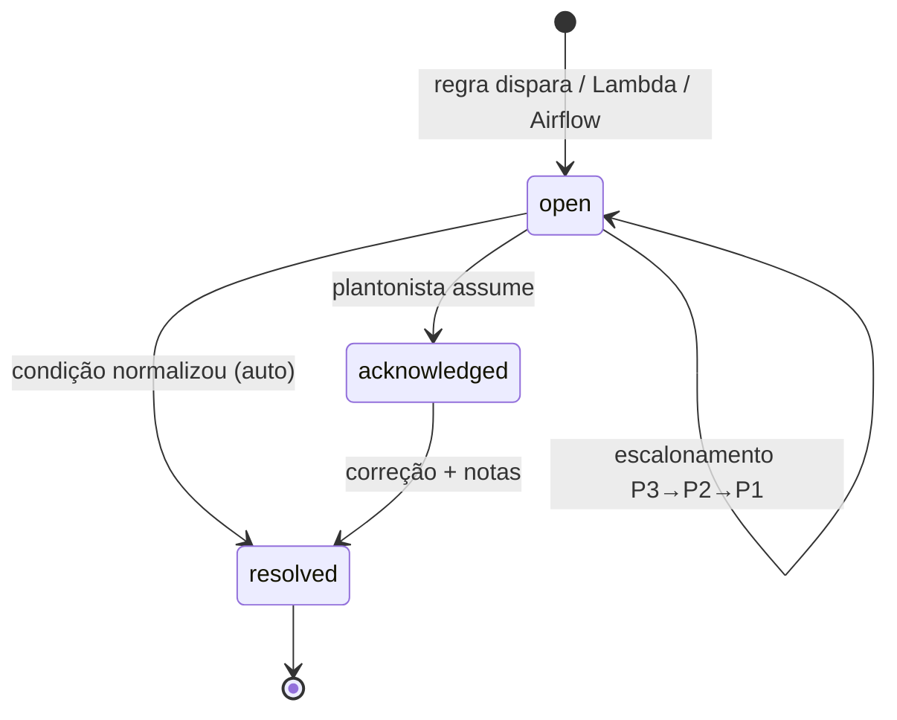

# Processo de incidentes

## Severidades

| Sev. | Definição | Exemplos | Resposta | Resolução |
|---|---|---|---|---|
| **P1** | Captura parada ou dados desatualizados para o negócio | sucesso < 50%, sem dado novo há mais de 10 min, workers fora | 15 min | 2 h |
| **P2** | Degradação relevante ou falha que exige correção de código | sucesso < 90%, layout mudou, rate limit, jobs na DLQ, DAG falhou | 30 min | 8 h |
| **P3** | Sintoma sem impacto imediato | latência alta, mais de 5% de itens inválidos, backlog na DLQ | 4 h | 48 h |

- **Resposta** = tempo até alguém **assumir** o incidente (botão *Assumir* / `POST /ack`).
- **Resolução** = tempo até o incidente ser **resolvido** (manual ou automático).
- O SLA fica **em risco** quando 75% do prazo de resolução já passou.

## Ciclo de vida



## Checklist do plantonista

1. **Assumir** o incidente (registra o horário de resposta).
2. Abrir o **runbook** correspondente (`docs/runbooks/`).
3. **Comunicar** o negócio em P1, e em P2 quando houver impacto em dados.
4. Registrar **notas** durante a investigação: hipóteses, evidências, comandos executados.
5. Corrigir: manutenção corretiva (código/config) ou contorno (escalar, pausar, aumentar timeout).
6. Fazer o **redrive da DLQ**, se houver jobs perdidos.
7. **Resolver** com causa raiz e ação tomada (campo obrigatório, mínimo de 10 caracteres).
8. Para P1: escrever um **post-mortem** (modelo abaixo) em até 2 dias úteis.

## Modelo de comunicação

```
[P1] Captura de preços da Loja Alpha interrompida
Início: 04:12 (BRT) | Status: investigando | Próxima atualização: 04:45
Impacto: preços da Alpha não são atualizados desde 04:02. Demais fontes normais.
Causa provável: o site alterou a estrutura das páginas de catálogo.
Ação em andamento: ajuste do parser; previsão de normalização às 05:30.
Responsável: <nome>
```

## Modelo de post-mortem (sem culpados)

```
Título / Severidade / Duração (detecção → resolução)
Linha do tempo (dos eventos do incidente: GET /api/incidents/{id})
Impacto (fontes, páginas, volume de dados atrasados)
Causa raiz (5 porquês)
O que funcionou / o que não funcionou na detecção e na resposta
Ações (preventivas e de detecção), com responsável e prazo
```

## Manutenção preventiva (rotina do turno)

- Revisar incidentes P3 abertos antes que virem P2/P1.
- Conferir se a DLQ está vazia e se não há jobs presos.
- Comparar o volume de produtos capturados com o dia anterior (quedas silenciosas).
- Atualizar fixtures de teste com HTML real recente de cada fonte.
- Revisar thresholds das regras que geraram alertas falsos (ruído cansa o plantão).
